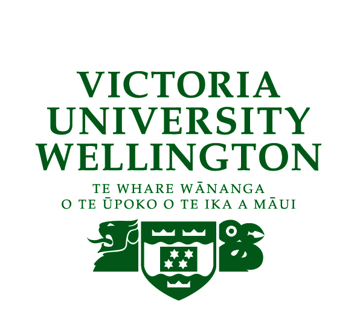

# Welcome to the 2019 MapNet meeting

MapNet2019 will be held in Wellington, New Zealand, at Victoria University of Wellington from November 18–19.

[**Click here for the conference programme**](https://vuwgenomics.github.io/mapnet2019.github.io/pdfs/MapNet2019programme.pdf).

**[Click here to register](https://vuw.eventsair.com/mapnet-2019/mapnet2019)**.

## MapNet 2019

MapNet2019 themes include primary sector genomics, bioinformatics, integrating indigenous genomics into research and teaching, methodology advances, and ecological & evolutionary genomics. The program and times will be updated closer to the meeting date and posted here as a pdf.

## Sponsors

{:target="_blank"}

{:target="_blank"}

{:target="_blank"}
   

{:target="_blank"}
   

### About MapNet 

MapNet is a group of New Zealand-based molecular and quantitative geneticists from organisations involved in research related to genomics. Organisations represented include Universities (Auckland, Canterbury, Massey, Otago, Unitec, Victoria), Crown Research Institutes (AgResearch, Environmental Science and Research, Landcare Research, NIWA, Plant & Food Research, Scion) and private entities (AbacusBio, The Elshire Group, Livestock Improvement Corporation). They encompass New Zealand's health, primary production, and environment genetics sectors. MapNet aims to coordinate scientists from different organisations using common technologies and analytical platforms, to foster the development of multidisciplinary and cross-sector research projects, and to facilitate knowledge exchange between researchers.

We look forward to seeing you in Wellington.

Peter Ritchie (conference organiser)

   

